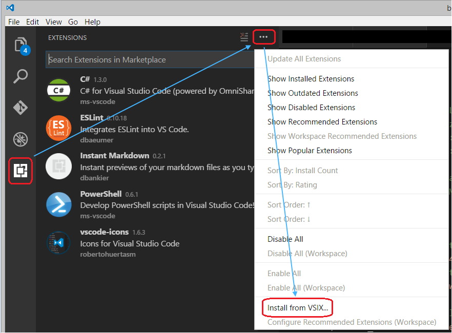

Open Salesforce Org in Browser
==============================

My first [VS Code extension](https://code.visualstudio.com/docs/editor/extension-gallery); a simple one to start with, open the (default) Salesforce Org as specified in the Salesforce CLI in a browser of your choice (i.e. not the default browser).

Started out by getting a basic grounding of the [VS Code Extension API](https://code.visualstudio.com/api) and going from there.

## Requirements

This extension piggy backs off the standard [Salesforce CLI](https://developer.salesforce.com/tools/sfdxcli) and therefore needs Salesforce CLI to be installed and in the current path.

Also requires a default (for workspace or global) Salesforce Org registered with the Salesforce CLI; ideally this is suited for SFDX development.

## Installation

Install the plugin from the command line with

```
code --install-extension vs-code-ext-sf_org_open_browser-0.0.1.vsix
```

Alternatively the extension can be installed from inside VS Code using the extension manager
- Ctrl+Shift+X
- Click on the elipsis (three dots)
- Install from VSIX



The extension can be removed by selecting uninstall.

If you get into difficulties the VS Code extensions are stored in the following locations and can be removed manually

Windows %USERPROFILE%\.vscode\extensions
macOS ~/.vscode/extensions
Linux ~/.vscode/extensions

## Usage

After installation you can open the command palette in VS Code (ctrl+shift+P); enter a valid scratch org, select a browser.

The browser selection is not currently configurable, this may change in the future.

NB:
If you have an SFDX project open with default scratch org set then you can omit the scratch org name if you want to use the default.
You can exit the process by pressing the ESC key when entering the scratch org or selecting a browser.

## Development

This is a basic VS Studio Code extension; written using the instructions found here: 
- https://code.visualstudio.com/api/get-started/your-first-extension

To test/enhance and debug open the source code in VS Code and press F5 to run, a new instance of VS Code is opened, the extension is available to use in the command palette.

For additional guidance in writing extensions and adding functionality such as prompts or windows Microsoft have provided a samples repository, see:
- https://github.com/Microsoft/vscode-extension-samples

## Build and Packaging

Package the component using vsce, see:
- https://code.visualstudio.com/api/working-with-extensions/publishing-extension

From the command line
```
vsce package
```

The package version can only be incremented when publishing the extension, as this package has limited availability the version number needs to be incremented manually.

License and Authors
-------------------
Authors: Chris Sullivan
